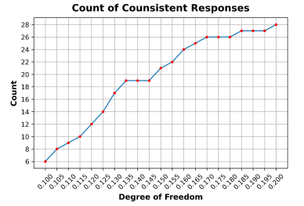
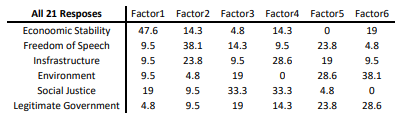
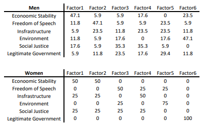
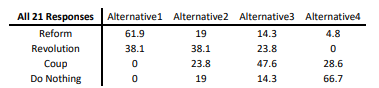
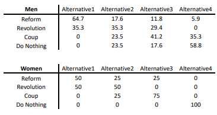

# **How to achieve an effective government?**

**Note:** This project was done during the height of the "Woman, Life, Freedom" movement in Iran, as the group capstone project to the course "Decision Theory". Since it was a very sensitive issue in Iran with the potential of grave repercussions, and for the sake of our own and the participants' safety, the scope of this project was very limited.

In 1789, when Louis XVI learned of the storming of the Bastille prison by angry French people, he asked, "Is this a revolt?" and Duke de La Rochefoucauld-Liancourt replied, "No, Sire, it is a revolution!"

## **Introduction**

People have always resisted oppressive and tyrannical regimes. Sometimes people merely submit to the current conditions and nurture the hope of a brighter future, or they strive to confront their corrupt and ineffective rulers through various means. The bitter reality is that individuals living under injustice and oppression often perceive the power of the ruling class as greater than their own ability to effect change. Even when people rise up to change their circumstances, many of these actions remain fruitless and are easily suppressed. The members of a society, when faced with an ineffective government, choose among these alternatives based on minimizing costs for themselves and maximizing costs for the ruling power. These efforts can take various forms, from attempts at reform and change to complete revolution and overthrow. It is even possible that over time, people may realize that past paths have been futile and turn towards different approaches. Undoubtedly, all human efforts to achieve a more peaceful life, a brighter future, and a fairer system are commendable.

## **Project Approach to the Chosen Topic and General Framework**

Initially, we delve into ways of responding to or changing an ineffective government, with a more detailed focus on revolution. The results of this section contribute to the alternatives in a survey. In the next section, "When Should We Overthrow Our Government?" we examine the viewpoints of experts and their legal opinions, as well as the concept of the "right to revolution," and explore the importance of addressing laws in this context. We then move on to identify significant factors of discontent that influence people's decision-making when dealing with an ineffective government, using examples from the Iranian Revolution of 1957. The we examine what governments can do to defend themselves using the Minimax method. Next, we consider the issue from the perspective of the people and examine under what conditions and with what outcomes they are willing to unite against their ineffective governments, using insights from game theory. We then explore the role of social networks as a crucial decision-making element in the 21st century and the reduction of costs in revolutions, using the concepts of desirability and decision nodes for multi-stage decision modeling. Considerations, models, assumptions, objectives, limitations, options, alternatives, and probabilities of all these models are detailed in their respective sections. At this point, the literature review and case studies conclude.

Furthermore, based on the study's results, a questionnaire was prepared to assess the importance of various social, economic, environmental criteria, etc., in the perception of different individuals compared to each other. Subsequently, several options for achieving each of these ideals and criteria are presented and offered among the ways to change ineffective governments for individuals to determine their desired choice. Finally, using the survey results, we examine the criteria and alternatives of the respondents using the Analytic Hierarchy Process (AHP) method and report the findings.

Alternatives on how to change a government addressed in the AHP model are:

1. Strikes and Protests for Reforms
2. Strikes and Protests for Revolution
3. Coup d'état
4. Doing Nothing

Criteria assessed:

1. Economic Stability (Central Bank Independence, Free Market, International Trade, Low Unemployment Rate, etc.)
2. Freedom of Expression and Thought (Political and Ideological Perspectives, etc.)
3. Proper Infrastructure (High-speed Internet Access, Water, Electricity, Gas, Safe and Suitable Roads, etc.)
4. Environmental Conditions (Animal Rights, Air Pollution Control, Preservation of Lakes, Forest Fire Prevention, etc.)
5. Social Justice (Equal Access to Education, Income Distribution, Gender Equality, Access to Healthcare Services, etc.)
6. Legitimacy, Transparency, and Independence of the Three Branches of Government (Legislative, Executive, and Judicial)

In setting the criteria, we attempted to avoid defining scattered criteria and grouped them under broader headings. To clarify our intended meaning for these broader criteria, we provided some examples for each in parentheses. Then, using Google Forms, we created the structure of the survey according to our desired format and made it available to participants. It should be noted that this survey was conducted anonymously and with sensitivity to the subject matter under study. We made efforts to ensure the anonymity of participants and inform them about the potential consequences of participation, thus providing them with a safe environment to express their opinions.

The survey was conducted on circa 39 people and after cleaning the data gathered, only the answers of 22 were kept. These are the results of the survey using the AHP model. In general, women were seeking a more immediate and radical answer to the current defectiveness of the Iranian Government:

  1. Count of Consistent Responses:

  2. Criteria Results:

  3. Alternative Results:

